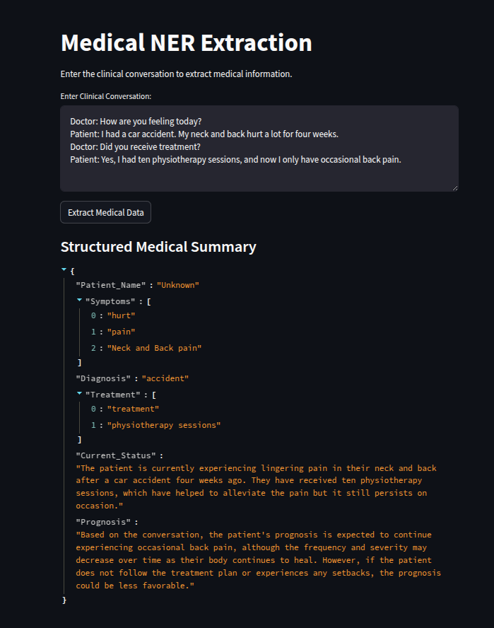
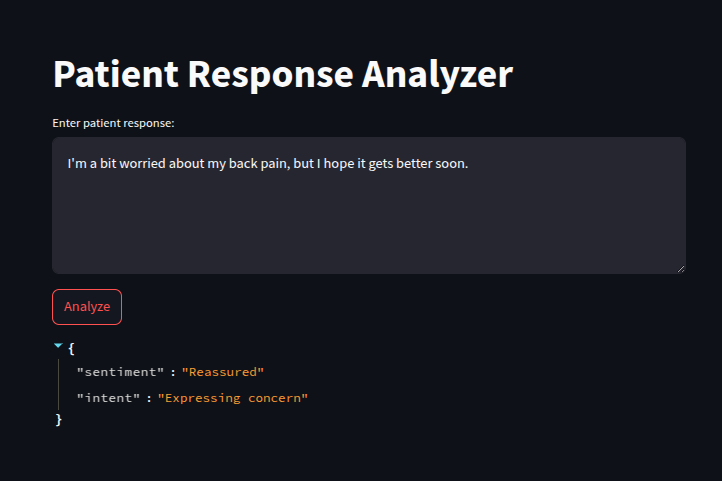
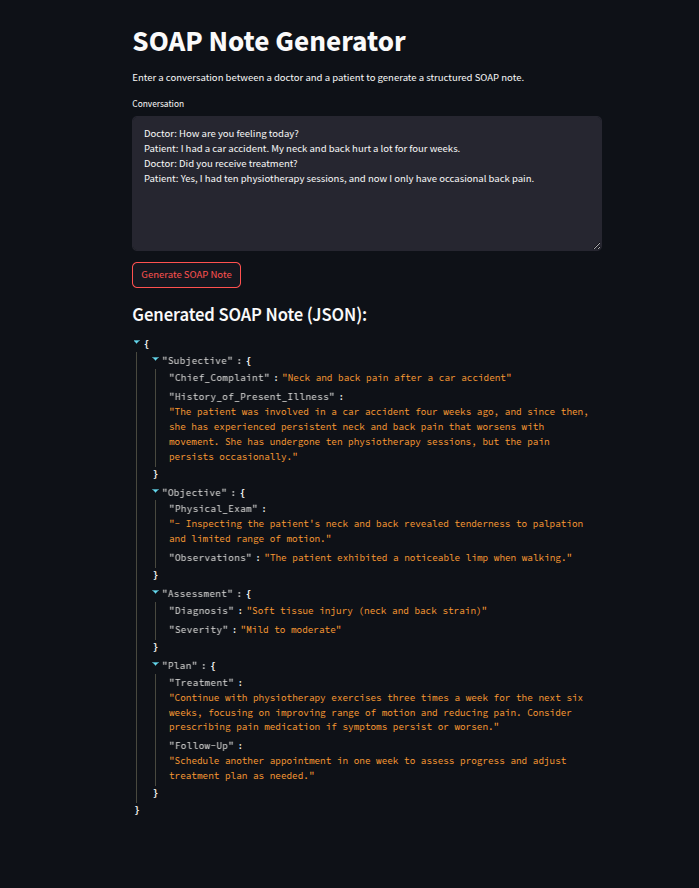

# Medical Conversation to JSON Converter

This project is a **Medical Conversation to JSON Converter** built using **Streamlit** and **Llama 2** (via `ctransformers`). It extracts key medical details from doctor-patient conversations and structures them into a **JSON format**.

## Features
- Uses **Llama 2** for text generation
- Utilizes **blaze999/Medical-NER** for medical Named Entity Recognition (NER)
- Extracts patient information, symptoms, diagnosis, treatment, and prognosis
- Outputs the results in **structured JSON format**
- Simple UI built with **Streamlit**
- Supports GPU acceleration for faster inference

## Installation
### Prerequisites
Ensure you have the following installed:
- Python 3.8+
- pip

### Install Dependencies
```bash
pip install streamlit ctransformers torch transformers langchain_community
```

### Download the Model
The Llama 2 model file (`llama-2-7b-chat.Q6_K.gguf`) can be downloaded from **Google Drive**:
[Download Here](https://drive.google.com/file/d/1NbIqcK00t6wrVCiV_J4SFi6_Uj2w7Hf6/view?usp=drive_link)

Place the downloaded model file in the appropriate directory, as specified in the script.

## Usage
### Run the App
For `task1.py` and `task3.py`, run the following command:
```bash
streamlit run task1.py -- --model_path /path_to_model
```
```bash
streamlit run task3.py -- --model_path /path_to_model
```

For `task2.py`, run:
```bash
streamlit run task2.py
```

### How It Works
1. Enter a **doctor-patient conversation** in the text box.
2. Click **Generate JSON Output**.
3. The structured **medical details** will be displayed in JSON format.

### Generating and Loading the App
Since this project runs using **Streamlit**, the application will generate a **local URL** once launched. Open the URL displayed in the terminal (usually `http://localhost:8501/`) in your web browser to interact with the app.

If accessing from another device in the local network, find your local IP address and run:
```bash
streamlit run task1.py --server.address 0.0.0.0
```
Then access it via `http://<your_local_ip>:8501/` on another device.

## Project Structure
```
📂 Medical-Conversation-JSON
├── task1.py                # Streamlit app with model path requirement
├── task2.py                # Streamlit app without model path requirement
├── task3.py                # Streamlit app with model path requirement
├── README.md               # Documentation
└── requirements.txt        # List of dependencies
```

## Example Outputs
### Task 1
#### Sample Input
```
Doctor: How are you feeling today?
Patient: I had a car accident. My neck and back hurt a lot for four weeks.
Doctor: Did you receive treatment?
Patient: Yes, I had ten physiotherapy sessions, and now I only have occasional back pain.
```

#### Screenshot


---

### Task 2
#### Sample Input
```
"I'm a bit worried about my back pain, but I hope it gets better soon."
```

#### Screenshot


---

### Task 3
#### Sample Input
```
Doctor: How are you feeling today?
Patient: I had a car accident. My neck and back hurt a lot for four weeks.
Doctor: Did you receive treatment?
Patient: Yes, I had ten physiotherapy sessions, and now I only have occasional back pain.
```

#### Screenshot


## Contributing
Feel free to fork the repo and submit a pull request if you have improvements!

## Contact
For any issues or suggestions, please open an **issue** in the repository.
